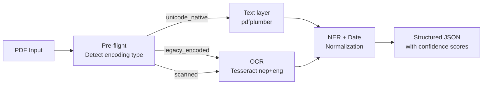

# LamiSema

**Structured information extraction for Nepali PDFs.**

[](https://pypi.org/project/lamisema/)
[](https://www.python.org/)
[](https://github.com/sanjiblamichhane/lamisema/actions)
[](LICENSE)

---

## The problem

Most Nepali PDFs silently return wrong output when you use standard tools on them. There are three types, each needing a different approach:

| PDF type | Example source | Standard tool result |
|---|---|---|
| **Unicode-native** | Modern government portals | ✅ Works fine |
| **Legacy-encoded** | Pre-2010 docs using Preeti/Kantipur font | ❌ Returns garbage (`g]kfn` instead of `नेपाल`) |
| **Scanned** | Physical forms, old records | ❌ Returns empty string |

LamiSema detects the type first and automatically routes to the right strategy.

---

## How it works



---

## Install

```bash
pip install lamisema
```

**System dependency** — Tesseract with the Nepali language pack:

```bash
# macOS
brew install tesseract tesseract-lang

# Ubuntu / Debian
sudo apt-get install tesseract-ocr tesseract-ocr-nep
```

---

## Python usage

```python
from lamisema import LamiSema

pipeline = LamiSema()

with open("report.pdf", "rb") as f:
    result = pipeline.extract(f.read(), filename="report.pdf")

print(result.encoding_type)        # "legacy_encoded"
print(result.overall_confidence)   # 0.74
print(result.pages[0].entities)    # [Entity(type="DATE_BS", text="२०८१ साल असार १५", ...)]
```

---

## REST API

Start the server:

```bash
lamisema serve
# → http://localhost:9001/docs
```

```bash
# 1. Upload
curl -X POST http://localhost:9001/upload -F "file=@report.pdf"
# → { "doc_id": "DOC-A1B2C3D4" }

# 2. Detect encoding (fast, no extraction)
curl http://localhost:9001/preflight/DOC-A1B2C3D4

# 3. Extract everything
curl -X POST http://localhost:9001/extract/DOC-A1B2C3D4

# 4. Get result
curl http://localhost:9001/result/DOC-A1B2C3D4
```

| Method | Endpoint | Description |
|---|---|---|
| `GET` | `/` | Health check |
| `POST` | `/upload` | Upload a PDF, get `doc_id` |
| `GET` | `/preflight/{doc_id}` | Encoding type + font analysis |
| `POST` | `/extract/{doc_id}` | Full extraction + NER |
| `GET` | `/result/{doc_id}` | Retrieve completed result |
| `POST` | `/normalize-dates` | Normalize BS dates in raw text |

---

## Try the demo app

A full-stack demo (Next.js frontend + API + MinIO) is in [`application-demo/`](application-demo/).

```bash
cd application-demo
cp .env.example .env
docker compose -f docker-compose.local.yaml up --build
# → http://localhost:3000
```

---

## Docs

Full documentation at **[lamisema.readthedocs.io](https://lamisema.readthedocs.io)**

- [Installation](docs/installation.md)
- [Python API](docs/python-api.md)
- [REST API Reference](docs/api-reference.md)
- [Encoding types explained](docs/encoding-types.md)
- [Contributing](docs/contributing.md)

---

## License

MIT — see [LICENSE](LICENSE)
