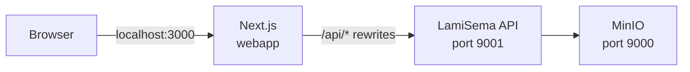

# LamiSema — Demo App

A full-stack demo of [lamisema](https://pypi.org/project/lamisema/): upload a Nepali PDF, detect its encoding, and extract structured entities — all in a browser.

```
application-demo/
├── webapp/                     Next.js 15 frontend
├── docker-compose.local.yaml   Local dev stack
├── docker-compose.prod.yaml    Production stack
└── .env.example                Environment variable template
```

## Architecture



The webapp proxies all `/api/*` requests to the API — the browser never calls the API directly, so no CORS setup is needed.

---

## Local setup

### Prerequisites

- [Docker Desktop](https://www.docker.com/products/docker-desktop/) (includes Docker Compose)

### Steps

```bash
# 1. Copy the env file
cp .env.example .env

# 2. Build and start all services
docker compose -f docker-compose.local.yaml up --build
```

That's it. All three services start together.

| Service | URL | Notes |
|---|---|---|
| Frontend | http://localhost:3000 | Next.js SPA |
| API + Swagger | http://localhost:8001/docs | FastAPI interactive docs |
| MinIO console | http://localhost:9001 | Login: `minioadmin` / `minioadmin` |

### Common commands

```bash
# View logs
docker compose -f docker-compose.local.yaml logs -f

# Rebuild one service (e.g. after editing the webapp)
docker compose -f docker-compose.local.yaml up --build webapp

# Stop everything (keep MinIO data)
docker compose -f docker-compose.local.yaml down

# Stop and wipe MinIO data
docker compose -f docker-compose.local.yaml down -v
```

---

## Production setup

### 1. Configure `.env`

```bash
cp .env.example .env
```

Change these values before deploying:

| Variable | What to set |
|---|---|
| `MINIO_ROOT_USER` | Strong username (not `minioadmin`) |
| `MINIO_ROOT_PASSWORD` | Strong password (min 12 chars) |
| `LAMI_S3_ACCESS_KEY` | Same as `MINIO_ROOT_USER` |
| `LAMI_S3_SECRET_KEY` | Same as `MINIO_ROOT_PASSWORD` |

### 2. Start

```bash
docker compose -f docker-compose.prod.yaml up --build -d
```

Services start in dependency order with health checks. The webapp is on port `3000` — put Nginx or Caddy in front for HTTPS.

### 3. Upgrade the API to a new lamisema release

The API installs `lamisema` from PyPI on build. To upgrade:

```bash
docker compose -f docker-compose.prod.yaml build --no-cache api
docker compose -f docker-compose.prod.yaml up -d api
```

### Using AWS S3 instead of MinIO

Update `.env`:

```
LAMI_S3_ENDPOINT=
LAMI_S3_ACCESS_KEY=<your-aws-access-key>
LAMI_S3_SECRET_KEY=<your-aws-secret-key>
LAMI_S3_BUCKET=<your-bucket-name>
```

Then remove the `minio` service from `docker-compose.prod.yaml`.

---

## Environment variables

| Variable | Default | Description |
|---|---|---|
| `LAMI_STORAGE_TYPE` | `s3` | `memory`, `disk`, or `s3` |
| `LAMI_S3_ENDPOINT` | `http://minio:9000` | S3-compatible endpoint |
| `LAMI_S3_ACCESS_KEY` | `minioadmin` | S3 access key |
| `LAMI_S3_SECRET_KEY` | `minioadmin` | S3 secret key |
| `LAMI_S3_BUCKET` | `lamisema-vault` | Storage bucket name |
| `MINIO_ROOT_USER` | `minioadmin` | MinIO admin username |
| `MINIO_ROOT_PASSWORD` | `minioadmin` | MinIO admin password |
| `API_URL` | `http://api:9001` | Internal API URL used by the webapp |
