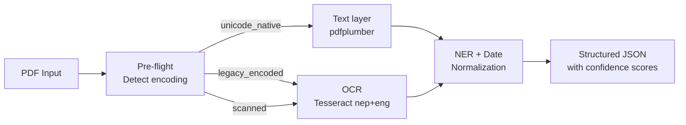

# LamiSema

**Structured information extraction for Nepali PDFs.**

[](https://pypi.org/project/lamisema/)
[](https://www.python.org/)
[](https://github.com/sanjiblamichhane/lamisema/actions)
[](https://github.com/sanjiblamichhane/lamisema/blob/master/LICENSE)

---

## The problem

Most tools silently return wrong output on Nepali PDFs. There are three types, each needing a different approach:

| PDF type | Common source | What standard tools return |
|---|---|---|
| **Unicode-native** | Modern government portals, banks | ✅ Correct text |
| **Legacy-encoded** | Pre-2010 docs using Preeti/Kantipur font | ❌ Garbage (`g]kfn` instead of `नेपाल`) |
| **Scanned** | Physical forms, old records | ❌ Empty string |

LamiSema detects the type first, then routes to the right strategy automatically.

---

## How it works



---

## Install

```bash
pip install lamisema
```

Install Tesseract (required for legacy/scanned PDFs):

=== "macOS"
    ```bash
    brew install tesseract tesseract-lang
    ```

=== "Ubuntu / Debian"
    ```bash
    sudo apt-get install tesseract-ocr tesseract-ocr-nep
    ```

---

## Quick start

```python
from lamisema import LamiSema

pipeline = LamiSema()

with open("report.pdf", "rb") as f:
    result = pipeline.extract(f.read(), filename="report.pdf")

print(result.encoding_type)        # "legacy_encoded"
print(result.overall_confidence)   # 0.74
print(result.pages[0].entities)    # [Entity(type="DATE_BS", ...)]
```

Or start the REST API:

```bash
lamisema serve
# → http://localhost:9001/docs
```

---

## What's extracted

- **Encoding type** — detected automatically per document
- **Bikram Sambat dates** — `२०८१ साल असार १५` → `~2024-06-29 AD (approx)`
- **Currency** — `रु. १२,५००` normalized to `NPR 12500`
- **Organizations** — matched by Nepali suffix patterns (मन्त्रालय, कार्यालय, etc.)
- **Per-page confidence scores** and extraction method used

---

## Try the demo

Run the full stack (frontend + API + storage) locally:

```bash
cd application-demo
cp .env.example .env
docker compose -f docker-compose.local.yaml up --build
# → http://localhost:3000
```

---

## Next steps

- [Installation](installation.md) — full setup with Tesseract
- [Python API](python-api.md) — use LamiSema in your code
- [REST API](api-reference.md) — HTTP endpoints reference
- [Encoding types](encoding-types.md) — why the three types matter
- [Deployment](deployment.md) — run in production
